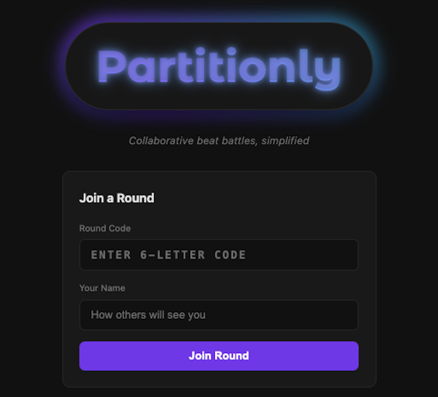
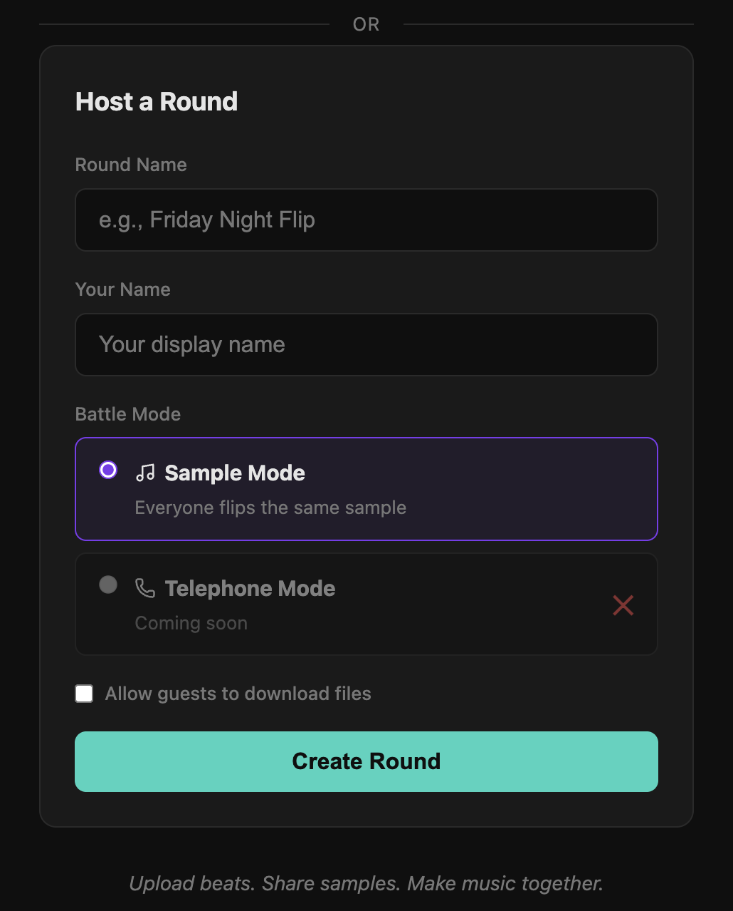
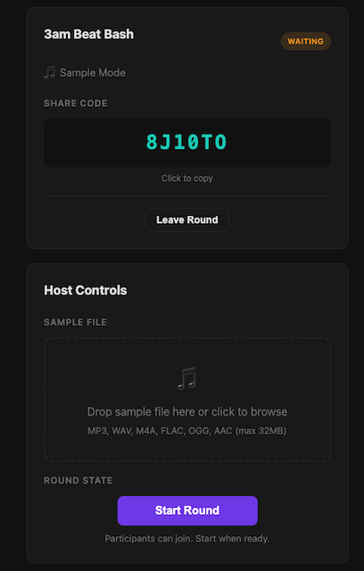
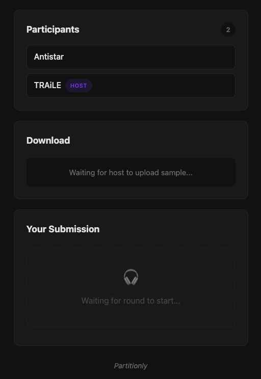

<div align="center">
    
</div>


<div align="center">
    <em>A fun music partitioning, collaborating, and distribution tool for producers</em>
</div>

## Description

A tiny web app for beat battles and remix exchanges. One person hosts a private lobby (join by short code), friends hop in, upload audio files, and at the end the host downloads everything as a ZIP.

### How It Works

1. **Host creates a round** - Pick a name, choose Sample Mode, get a 6-character code
2. **Share the code** - Friends join using the code
3. **Host uploads a sample** - Everyone can download it
4. **Participants upload remixes** - Host sees who has submitted
5. **Host closes the round** - Downloads all submissions as a ZIP

## Modes

**Sample Mode:**  
Everyone in the lobby downloads and remixes the same sample that the host uploads.

**Telephone Mode:**  
🚧 Coming soon...

## Tech Stack

- **Backend:** Go, Gorilla Mux, Redis
- **Frontend:** Vanilla HTML/CSS/JavaScript
- **Storage:** Redis (24-hour TTL), local filesystem for audio files

## Running Locally
```bash
# 1a. Start Redis (make sure you have redis installed [can install with `brew install redis`])
brew services start redis

# 1b. Or you can run in docker as well with this
docker run -d -p 6379:6379 redis

# 2. Run the server
go run .

# 3. Visit http://localhost:8080
```

## Screenshots

<div align="center">
    
    
</div>

<div align="center">
    
    
</div>